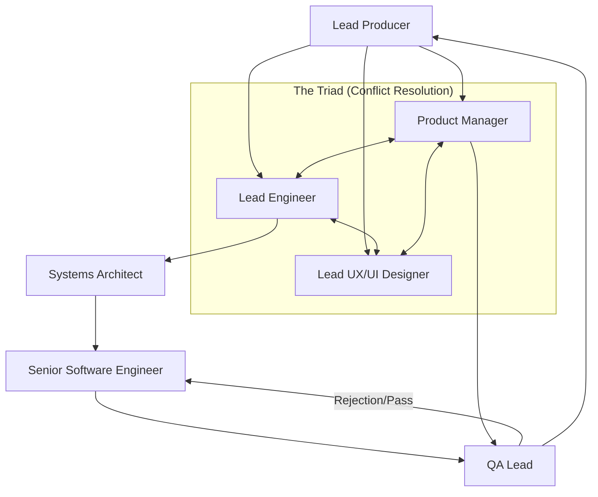

# Communication & Hierarchy

This document visualizes how sub-agents interact and the flow of information between them.

## Organizational Chart

## Information Flow

0.  **Mode Selection**: A primary Core mode accepts the user request. `Design` handles planning-oriented work; `Implement` handles execution-oriented work.
1.  **Product Vision**: The **Product Manager** defines the "What" and "Why".
2.  **Orchestration**: The **Lead Producer** determines the starting point and routes the workflow.
3.  **Technical Design**: The **Lead Engineer** translates product requirements into high-level technical specifications (TAD).
4.  **System Architecture**: The **Systems Architect** breaks down the TAD into modular components and interface definitions.
5.  **Implementation**: The **Senior Software Engineer** executes the changes based on the designs.
6.  **Quality Assurance**: The **QA Lead** validates the implementation against acceptance criteria and runs tests.
7.  **UX Validation**: The **Lead UX/UI Designer** verifies the final product against the intended experience.

## Systemic Rules

### The "Handoff Summary" Rule
When an artifact moves from **Systems Architect** (Design) to **Senior Software Engineer** (Execution), a "Context Flag" section must be appended.
- **Purpose**: To explicitly state *why* specific technical choices were made.
- **Benefit**: Prevents the engineer from hallucinating different reasons and breaking the intended design.

## Conflict Resolution: The Triad
When design goals (PM), technical feasibility (LE), and user experience (UX) clash, the "Triad" protocol is engaged:
- **Meeting of Minds**: The three agents must provide a joint "Resolution Memo".
- **Infinite Loop Prevention**: The **Lead Producer** monitors the Triad to ensure resolutions are reached and the workflow remains unblocked.

## Request Lifecycle
1. **Intake**: A primary Core mode accepts the request and determines whether it is planning-first or execution-first.
2. **Routing**: The primary mode routes to the appropriate Triad member or downstream specialist path.
3. **Review**: Lead Engineer assesses technical impact and sets standards.
4. **Design**: Systems Architect drafts the interface definitions and appends a **Handoff Summary**.
5. **Execution**: Senior Software Engineer implements the code.
6. **Verification**: QA Lead runs tests; if failed, returns to Execution with a **Rejection Report**.
7. **Closure**: Lead Producer marks the task as complete after UX/QA sign-off.
